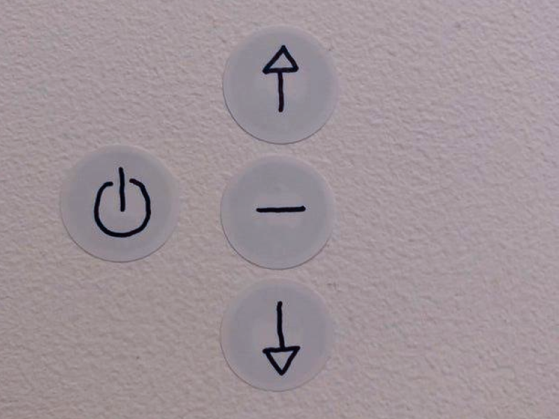
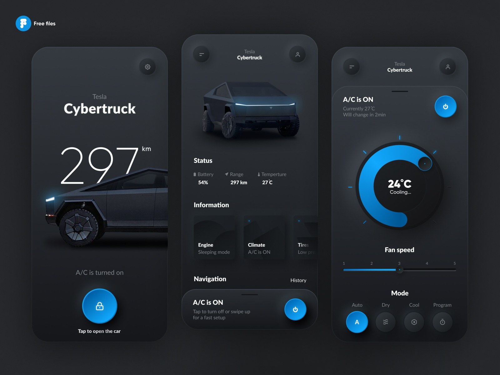
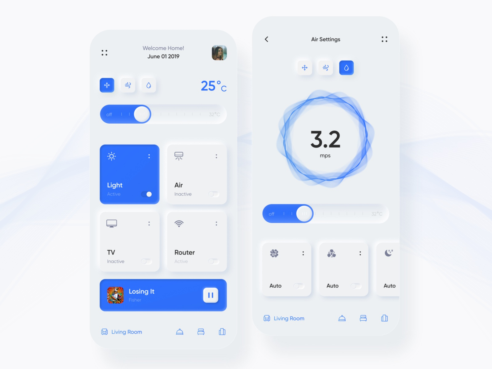

# Accessible Neumorphism :

While we talked about the issues around accessibility with regards to this new design trend called neumorphism in the <a href="https://a11y-friendly.netlify.app/neumorphism/">previous post</a>, the question remains, can this trend be accessible ?

The best way to find an answer to this question is to get back and have a look at some more examples around this neumorphic trend. While neumorphism is all about soft shadows and seamless designs, it is not always advocated to stick to white or some lighter color palettes. Neumorphism also comes up beautifully well with dark-colored themes where the contrast ratios are a lot better and at the same time, the tabbable and clickable areas are well defined.

The other point that always comes up with "inaccessible neumorphism" is that the components aren't well described which creates a lot of cognitive issues. Also, the states of the elements are not well established and as I mentioned before <strong>the confusion  revolves around "where to click"</strong> making the UI both clumsy as well as complicated. The best way to solve such a problem is defining the states of various elements i.e. when clicked, hovered  or focused.

In the example provided above, since the states of UI components are clearly defined using a secondary color, it makes the interface less <strong>confusing</strong>. The highlighted cards and buttons indicate the states of UI components, hence, signifying the action to be performed. This can solve both the issues of color contrast as well as confusing UI design. 

While figuring a bit about the superficial alternatives to neumorphism, I wanted to get my hands dirty and understand if it can actually be coded out to make it accessible further more.
There are three main pointers that directly affect the shadows which create these beautiful and seamless designs. Let's talk about these properties in more detail.

1. <strong>Distance</strong> : This decides the size/extent of the soft shadows that are generated on the edges. This should ideally be less so that the component is more prominent and highlighted.

2. <strong>Intensity</strong> : It measures the lightness/darkness of the shadows and again to make our component well defined, intensity should be high so that there is a clear demarcation between the component and the background.

3. <strong>Blur</strong> : Clearly, it defines the degree of blurriness of the shadow and should be less for cleaner UI.

Considering all the above points in mind, I came up with the below <a href="https://codepen.io/tanisha03/pen/NWGMREx">codepen</a> to understand each of these elements better.

<iframe height="500" style="width: 100%;" scrolling="no" title="Accessible Neumorphism" src="https://codepen.io/tanisha03/embed/NWGMREx?height=265&theme-id=default&default-tab=css,result" frameborder="no" allowtransparency="true" allowfullscreen="true">
  See the Pen <a href='https://codepen.io/tanisha03/pen/NWGMREx'>Accessible Neumorphism</a> by tanisha03
  (<a href='https://codepen.io/tanisha03'>@tanisha03</a>) on <a href='https://codepen.io'>CodePen</a>.
</iframe>

So, the main problem here revolves around the inability of the cards to come out highlighted across the background. Hence, following the less distant, more intense and less blurry shadows makes sense. The other point to be noted here is that, a lighter boundary for the components, button in the above case, makes the component a lot more prominent and highlighted for the users to take action. Along with the same, the border can be further manipulated for hover/focus states.

Hence, the takeaways from this is that accessible neumorphism is indeed possible. However, no matter how many steps are taken towards producing accessible neumorphism, it might not always be suitable for everyone, say for example low-sighted elderly people. Therefore, the best bet would be to allow the users to switch to normal/default mode in case they're not comfortable with it, something similar to dark mode and light mode analogy.

