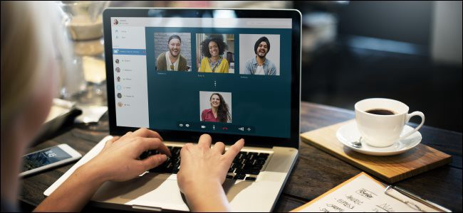
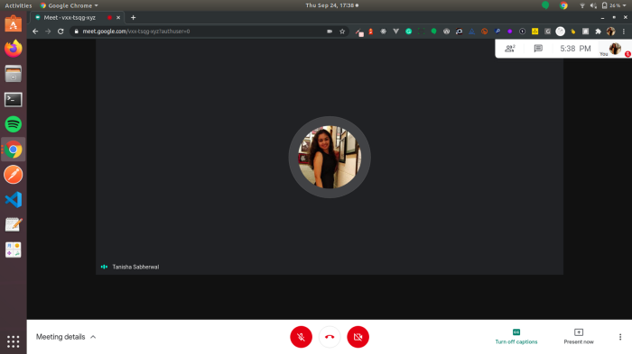
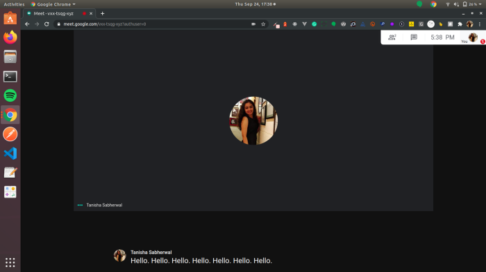
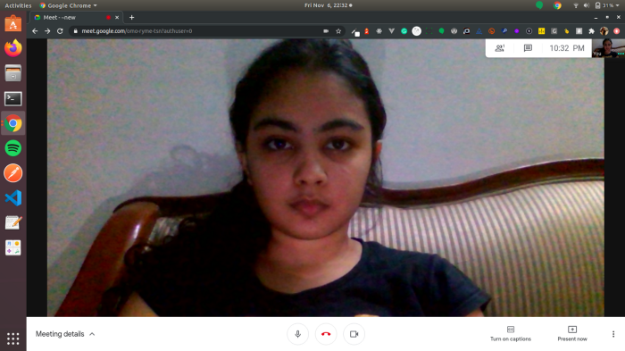
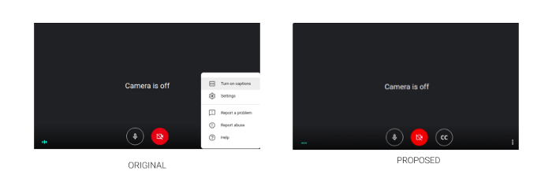

# Inclusivity in Video Conferencing - The New Normal :

Ever since the corporates made a shift to work from home amidst the global pandemic, communication hasn’t been the same. Daily interactions, scrums, and discussions seem to make their way through a 15-inch screen leaving very little room for facial cues and body language in communication. This has been a barrier in terms of having organic conversations between individuals which might lead to less performant outcomes or less productivity.

However, on the flip side, with companies moving remote, location constraint doesn’t seem to stand a chance which essentially means the best of minds from varied backgrounds can be hired from any corner of the globe. In such a case, it is indispensable that the work culture should be welcoming and inclusive for everyone to be on the same page.

## The Challenge

The key to deliverables and productivity in any group setting is communication. This has led to a boom of video conferencing platforms like Google Meet, Zoom, Microsoft Teams in the marketplace since colleagues are no longer under the same roof, as well as successfully replaced audio calls. Nevertheless, as pointed out earlier, video conferencing often inhibits harmonious conversations due to a lack of facial cues, eye contact, and body language.
The challenge here gets tougher for people with hearing impairment who depended heavily on lip movement and facial language. This might be an obstruction for them to produce prolific results because of being fell behind in conversations over these video conferencing platforms.

## The Design Flaw

Most of the famous video conferencing software has accessibility features that aim to streamline the experience for people with auditory impairments like build-in closed captions in Google Meet or integrations with a third-party tool like Otter, to produce speech-to-text transcriptions.

However, these existing solutions have some inherent flaws in them. Third-party tools like Otter often seem to lag after some time into the conversation. This proves to be highly inefficient for a person heavily dependent on it and may feel left out. However, examining the other alternative i.e. the inbuilt closed captions in video conferencing platforms also doesn’t persist without loopholes. Although we do have options for recording the calls, there isn’t a substituting mechanism that records the textual conversation to be referred to later for context. The use case remains analogous to the recording of video calls to be referred to sometime in the future. In continuation, since captions disappear with every new individual speaking, it requires undivided attention and concentration from the people towards the captions since historical conversation does not prevail.

A major design flaw that prevalent in Google Meet was the placement of the captions. The picture below is a reference for the misplacement of the closed captions. At first, the feature comes across as faulty because the uncollapsed action bar hides the captions. The overlapping of the action bar and the captions nullifies the purpose of providing the captions for inclusivity in the first place.

Another extremely important point was highlighted by Quinn Keast in one of his <a href='https://quinnkeast.com/writing/captions-in-video-calls-better-accessibility-but-harmful-side-effects'>articles</a>. Supporting our initial proposition as to how video calls lack facial cues and a touch of proximity, the caption placement at the bottom further adds overhead. The gaze fixed towards the bottom might come across as an <i>uninterested, devious, snobbish, or offending</i> look while it might not be so in the first place, piling on to the design flaws. This might put off individuals on the other side both in internal communication as well as vital communications outside workplaces like interviews leading to unfavorable implications. Hence, an attempt at inclusivity miserably fails in such a scenario with placing individuals who might depend on these captions at a disadvantage.

## The Next Steps

Products or features that might do more harm than good can be extremely disastrous in the long run and it is crucial to call out the same. With such accessibility features that claim to ease out the experience of the individuals, more control needs to be vested in the end-user to allow usage as per their convenience. While we saw, how the placement of captions fails to produce the expected result, something which could be worked upon is not restricting the placement of the caption by allowing drag and drop captions, similar to youtube subtitles. The default position of the captions could be somewhere on the top level for the gaze to be inclined towards the webcam, with the flexibility of placing it as per the user’s control.
Another way to better utilize such a feature and make the platform more inclusive is to give explicit control for captions along with the same extent as audio and video before any call onboarding. This will give the user a headstart to be prepared for a call, as we set up our mics and videos before joining in any call.

Moreover, this can be substituted with the ability to record conversations for any future context in terms of a transcript. This will help brief people with auditory disabilities to be on the same page in case they might have missed any meetings, analogous to how recorded video meetings might give us context.

Captions work differently as compared to audio and video. It’s rightly said, for the auditory disabled “Captions are the content, everything else is context”. Hence, there should be separate principles for the working of the same. The attempt for such platforms to provide inclusivity should be well thought and multidimensional so that any individual should not be at a disadvantage during any of the critical moments including interviews and other meeting calls.
