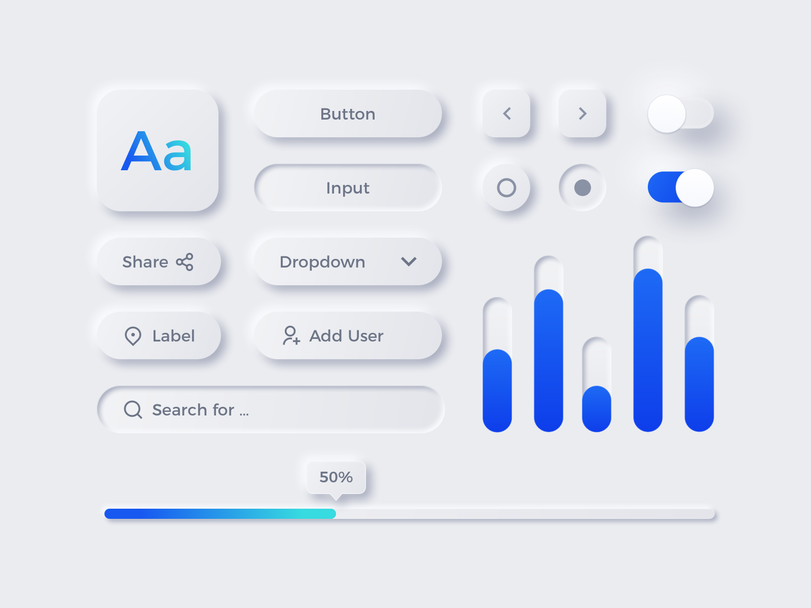
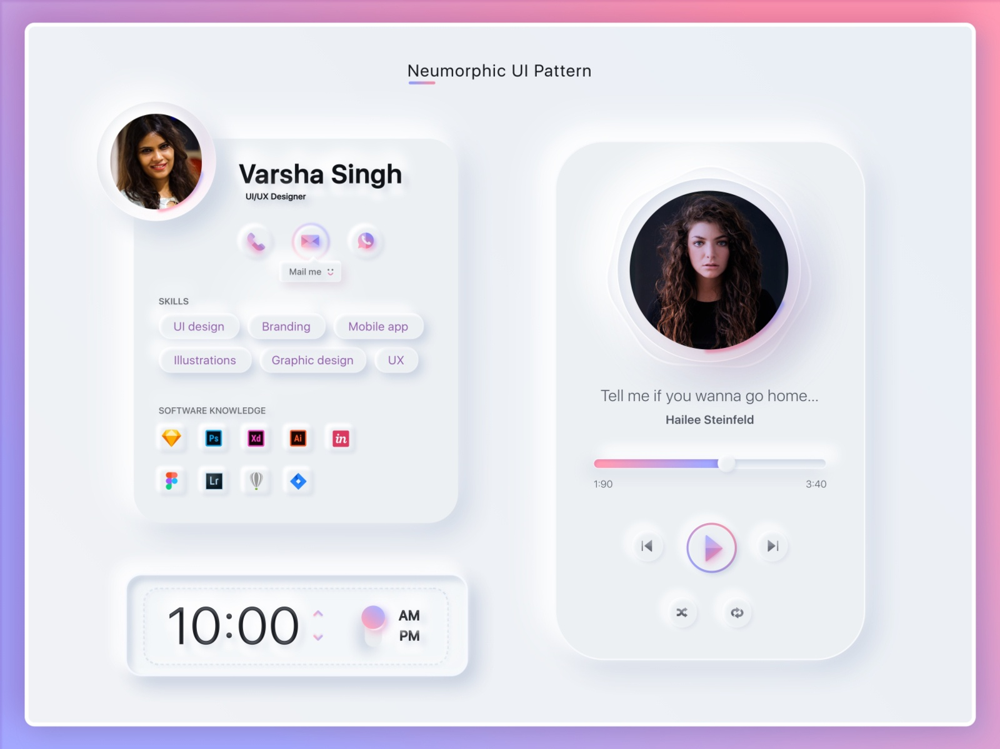

# Neumorphism and Accessibility :

Amidst the hype of fancy UI design trends that continuously flood <a href="https://dribbble.com/search/neumorphism">Dribble</a>, the real question is how accessible are these designs? With the outbreak of the craze around Neumorphism(New Skeuomorphism), designers are going crazy to replace the pre-existing designs over such new variations for their applications. I myself gave in to this trend and experimented to create a toggle switch on <a href="https://codepen.io/tanisha03/pen/YzyGjeO">Codepen</a>.  
To give a little background, Neumorphism is something like this, as shown in the image below.

The neumorphic designs give a raised or extruding effect to the components achieved by soft shadows. The whole game revolves around two shadows, one positive while one negative. The basic styling of the components in such a design should always be of a hue of the background color. Also, the background color should not be fully black or white for the shadows to pop up appealingly.

Recently, I saw one of the businesses adopting this UI design for its mobile application. While the whole of LinkedIn/Twitter Community went mad over it, no one talked about accessibility. Here, I would stress the fact that this same business dealt with 'Credit Card Payments' which may be used by mostly every age group of the population.

Before I explicitly highlight and list the issues with neumorphism, see it for yourself in the image below. 

If you look closely, while the Contrast Loss for our <a href="https://chrome.google.com/webstore/detail/nocoffee/jjeeggmbnhckmgdhmgdckeigabjfbddl">NoCoffee Simulator</a> is increased, the neumorphic components lose its shape and disappear while the text, with better contrast ratio, still remains visible. Therefore, the main problem with such a design is the <strong>LOW Contrast Ratio</strong>. The usability of any application does not stand a chance until all people irrespective of their age and abilities can use the interface. Hence, people with Contrast Loss face so much trouble with this kind of design. Not only that, but even  visually abled people using this application in bright sunlight may find difficulty in performing necessary actions owing to the soft shadows of the components. The main problem here is no clear demarcation between the background and UI components.

Another point to highlight is, this trend also causes problems for people with cognitive disabilities.

An interface with a lot of neumorphic components makes it too complicated to be comprehended. The confusion here revolves around "where to click" making the UI both clumsy as well as complicated.

Though I have just highlighted the accessibility issues regarding this new trend, I am not denying the possibility of "Accessible Neumorphic Interfaces". While I research and experiment my bit regarding the same, stay tuned to know more about including accessibility in neumorphism. 
